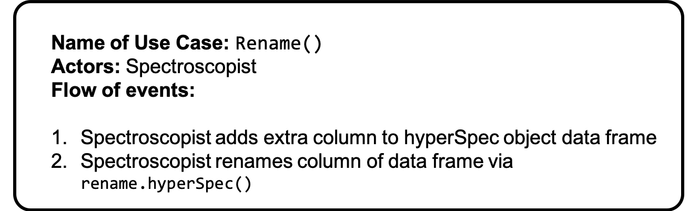
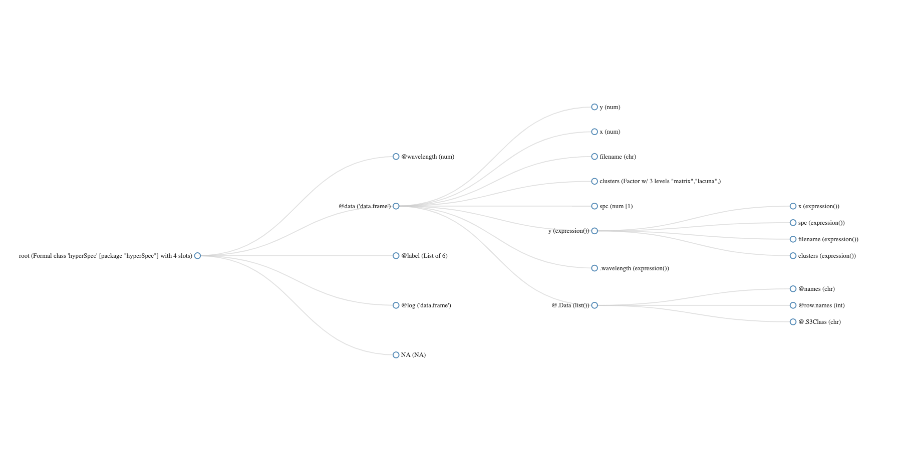
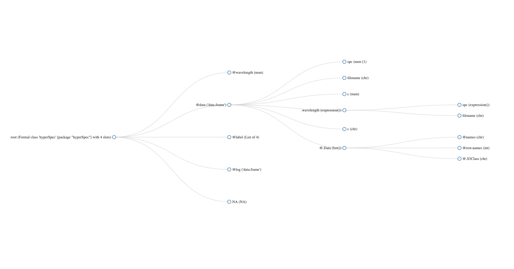
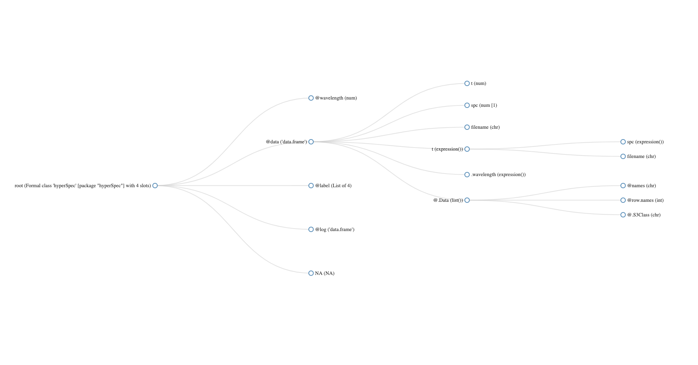
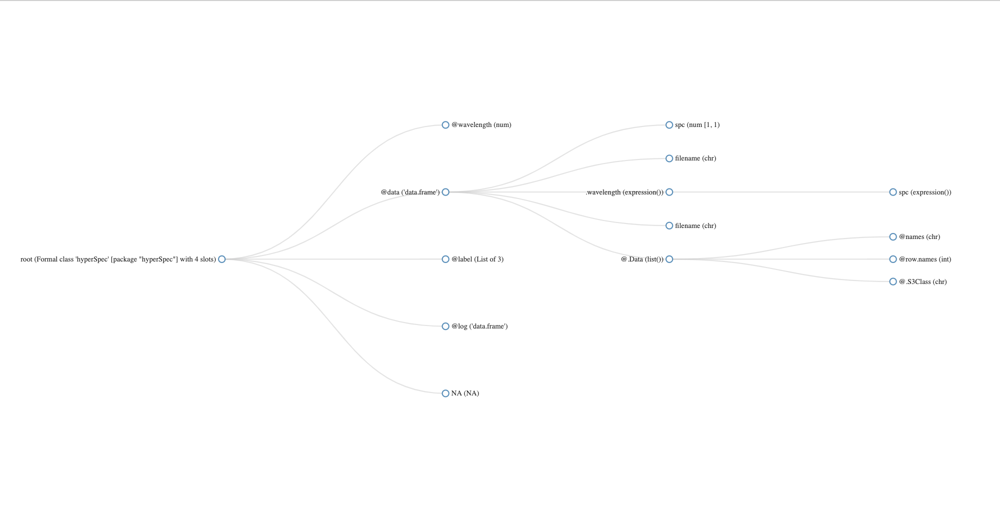
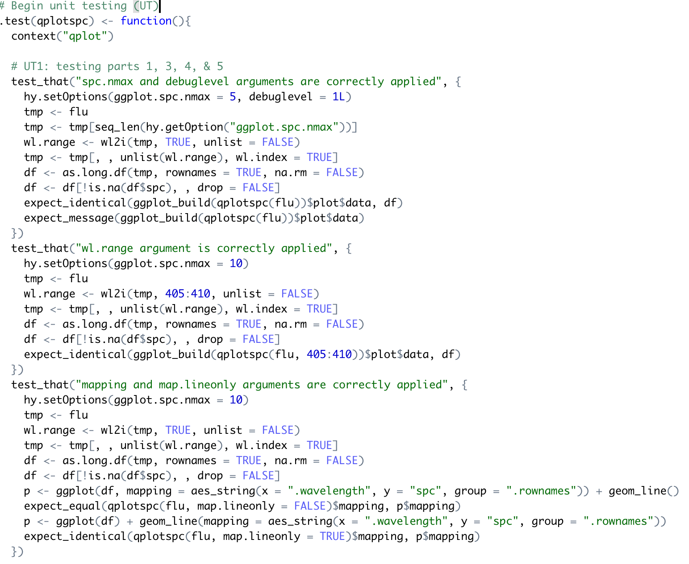
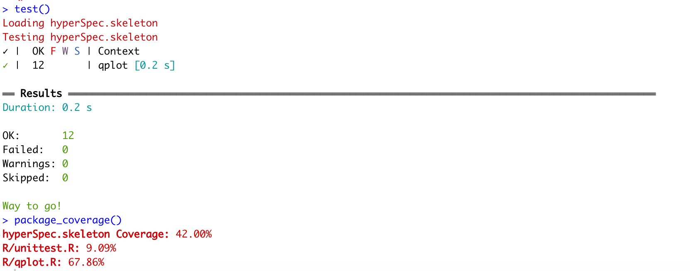

# R GSoC 2020 hyperSpec
<p style="line-height:12px"> <b>Student:</b> <i>Erick Oduniyi</i>; <b>Project:</b> <i>hyperSpec</i></p>
This README contains notes and solutions for the R GSoC 2020 hyperSpec test.

## 1. Easy
**Task:** _Install `hyperSpec`, `covr` and `lintr` from CRAN and `hyperSpec.tidyverse` from github._

---

```R
# Install hyperSpec, covr, and lintr packages from CRAN
install.packages("hyperSpec")
install.packages("lintr")
install.packages("covr")

# Install hyperSpec.tidyverse package from github
remotes::install_github("cbeleites/hyperSpec.tidyverse")
```
    The downloaded binary packages are in
    	/var/folders/4_/gg3mjn693bz4v5w1sxh71rtc0000gp/T//RtmpltRTPs/downloaded_packages

    also installing the dependencies ‘cyclocomp’, ‘xmlparsedata’

    The downloaded binary packages are in
    	/var/folders/4_/gg3mjn693bz4v5w1sxh71rtc0000gp/T//RtmpltRTPs/downloaded_packages

    The downloaded binary packages are in
    	/var/folders/4_/gg3mjn693bz4v5w1sxh71rtc0000gp/T//RtmpltRTPs/downloaded_packages

    Downloading GitHub repo cbeleites/hyperSpec.tidyverse@master

    ✔  checking for file ‘/private/var/folders/4_/gg3mjn693bz4v5w1sxh71rtc0000gp/T/RtmpltRTPs/remotes81a11e602b6a/cbeleites-hyperSpec.tidyverse-d2122a6/DESCRIPTION’
    ─  preparing ‘hyperSpec.tidyverse’:
    ✔  checking DESCRIPTION meta-information
    ─  checking for LF line-endings in source and make files and shell scripts
    ─  checking for empty or unneeded directories
    ─  building ‘hyperSpec.tidyverse_0.1.0.tar.gz’


## 2. Medium
**Task:** _Fork `hyperSpec` from github, use `lintr` to standardize code formatting, and submit a pull request with the improved code._

---

### 2.1. The nature of linting
<p align="justify">
In general, linting is a way to automatically debug code (i.e., error checking and code standardization) without executing the program. Linters aren't intelligent, so it only tries to adhere to a grammar and thus can only check for potential errors. There are two categories of linting: code style linting and syntax linting. There is no right or wrong way to lint, so it's important to choose a linting style (i.e., style convention) that fits the project.
</p>

<p align="justify">
So, linting is super helpful because it helps programmers adhere to style conventions. In the context of working on open source projects, this can add a bit of confidence to a programmers contribution, which of course is related to unit testing and continuous integration.
</p>

### 2.2. Applying `lintr` to hyperSpec
The `lintr` package is a very nice way to checks adherence to a given style, syntax errors and possible semantic issues.


```R
# Load lintr package
library(lintr)

# Go to the directory of hyperSpec source files
setwd("/path/to/directory/R")

# Check directory
list.files()
```
<ol class=list-inline><li>'aggregate.R'</li><li>'all.equal.R'</li><li>'apply.R'</li><li>'Arith.R'</li><li>'as.data.frame.R'</li><li>'barbiturates.R'</li><li>'bind.R'</li><li>'call.list.R'</li><li>'chk.hy.R'</li><li>'chondro.R'</li><li>'collapse.R'</li><li>'colMeans.R'</li><li>'Compare.R'</li><li>'count_lines.R'</li><li>'cov.R'</li><li>'decomposition.R'</li><li>'deprecated.R'</li><li>'dim.R'</li><li>'dimnames.R'</li><li>'DollarNames.R'</li><li>'droplevels.R'</li><li>'empty.R'</li><li>'extract.R'</li><li>'factor2num.R'</li><li>'fileio.optional.R'</li><li>'fix_spc_colnames.R'</li><li>'flu.R'</li><li>'getbynames.R'</li><li>'guesswavelength.R'</li><li>'hyperspec-class.R'</li><li>'hyperspec-package.R'</li><li>'initialize.R'</li><li>'labels.R'</li><li>'laser.R'</li><li>'levelplot.R'</li><li>'makeraster.R'</li><li>'map.identify.R'</li><li>'map.sel.poly.R'</li><li>'mark.dendrogram.R'</li><li>'mark.peak.R'</li><li>'Math.R'</li><li>'matlab.palette.R'</li><li>'mean_sd.R'</li><li>'merge.R'</li><li>'mvtnorm.R'</li><li>'normalize01.R'</li><li>'options.R'</li><li>'orderwl.R'</li><li>'paracetamol.R'</li><li>'paste.row.R'</li><li>'pearson.dist.R'</li><li>'plot.R'</li><li>'plotc.R'</li><li>'plotmap.R'</li><li>'plotmat.R'</li><li>'plotspc.R'</li><li>'plotvoronoi.R'</li><li>'qplot.R'</li><li>'qplotmixmap.R'</li><li>'quantile.R'</li><li>'rbind.fill.R'</li><li>'read.asc.Andor.R'</li><li>'read.asc.PerkinElmer.R'</li><li>'read.ENVI.HySpex.R'</li><li>'read.ENVI.Nicolet.R'</li><li>'read.ENVI.R'</li><li>'read.ini.R'</li><li>'read.jdx.R'</li><li>'read.mat.Cytospec.R'</li><li>'read.mat.Witec.R'</li><li>'read.spc.Kaiser.R'</li><li>'read.spc.R'</li><li>'read.spc.Shimadzu.R'</li><li>'read.spe.R'</li><li>'read.txt.Horiba.R'</li><li>'read.txt.long.R'</li><li>'read.txt.Renishaw.R'</li><li>'read.txt.Shimadzu.R'</li><li>'read.txt.wide.R'</li><li>'read.txt.Witec.R'</li><li>'regexps.R'</li><li>'replace.R'</li><li>'sample.R'</li><li>'scale.R'</li><li>'seq.R'</li><li>'show.R'</li><li>'spc.bin.R'</li><li>'spc.fit.poly.R'</li><li>'spc.identify.R'</li><li>'spc.loess.R'</li><li>'spc.NA.approx.R'</li><li>'spc.rubberband.R'</li><li>'spc.spline.R'</li><li>'split.R'</li><li>'split.string.R'</li><li>'splitdots.R'</li><li>'subset.R'</li><li>'Summary.R'</li><li>'sweep.R'</li><li>'trellis.factor.key.R'</li><li>'units.R'</li><li>'unittest.R'</li><li>'validate.R'</li><li>'vandermonde.R'</li><li>'wc.R'</li><li>'wl.R'</li><li>'wl2i.R'</li><li>'wleval.R'</li><li>'write.txt.long.R'</li><li>'write.txt.wide.R'</li><li>'y-pastenames.R'</li><li>'zzz.R'</li></ol>

```R
# Try using the lintr package on a single file
lint("aggregate.R")
```
    /path/to/directory/aggregate.R:1:1: style: Lines should not be more than 80 characters.
    .aggregate <- function (x, by = stop ("by is needed"), FUN = stop ("FUN is needed."),
    ^~~~~~~~~~~~~~~~~~~~~~~~~~~~~~~~~~~~~~~~~~~~~~~~~~~~~~~~~~~~~~~~~~~~~~~~~~~~~~~~~~~~~
    /path/to/directory/aggregate.R:1:24: style: Remove spaces before the left parenthesis in a function call.
    .aggregate <- function (x, by = stop ("by is needed"), FUN = stop ("FUN is needed."),
                           ^
    /path/to/directory/aggregate.R:1:38: style: Remove spaces before the left parenthesis in a function call.
    .aggregate <- function (x, by = stop ("by is needed"), FUN = stop ("FUN is needed."),
                                         ^
    /path/to/directory/aggregate.R:1:56: style: Variable and function name style should be snake_case.
    .aggregate <- function (x, by = stop ("by is needed"), FUN = stop ("FUN is needed."),
                                                           ^~~
    /path/to/directory/aggregate.R:1:67: style: Remove spaces before the left parenthesis in a function call.
    .aggregate <- function (x, by = stop ("by is needed"), FUN = stop ("FUN is needed."),
                                                                      ^
To get a better sense of the types of style suggestions `lintr` is proposing:

```R
# Collect lintr suggestions
lint.sugg <- lint("aggregate.R")

# Turn suggestions into a data frame
lint.df <- as.data.frame(lint.comments)
head(lint.df, 3)
```
<table>
<caption>A data.frame: 3 × 7</caption>
<thead>
	<tr><th scope=col>filename</th><th scope=col>line_number</th><th scope=col>column_number</th><th scope=col>type</th><th scope=col>message</th><th scope=col>line</th><th scope=col>linter</th></tr>
	<tr><th scope=col>&lt;chr&gt;</th><th scope=col>&lt;dbl&gt;</th><th scope=col>&lt;dbl&gt;</th><th scope=col>&lt;chr&gt;</th><th scope=col>&lt;chr&gt;</th><th scope=col>&lt;chr&gt;</th><th scope=col>&lt;chr&gt;</th></tr>
</thead>
<tbody>
	<tr><td>/path/to/directory/aggregate.R</td><td> 1</td><td> 1</td><td>style</td><td><span style=white-space:pre-wrap>Lines should not be more than 80 characters.                                 </span></td><td><span style=white-space:pre-wrap>.aggregate &lt;- function (x, by = stop ("by is needed"), FUN = stop ("FUN is needed."),   </span></td><td><span style=white-space:pre-wrap>line_length_linter              </span></td></tr>
	<tr><td>/path/to/directory/aggregate.R</td><td> 1</td><td>24</td><td>style</td><td><span style=white-space:pre-wrap>Remove spaces before the left parenthesis in a function call.                </span></td><td><span style=white-space:pre-wrap>.aggregate &lt;- function (x, by = stop ("by is needed"), FUN = stop ("FUN is needed."),   </span></td><td>function_left_parentheses_linter</td></tr>
	<tr><td>/path/to/directory/aggregate.R</td><td> 1</td><td>38</td><td>style</td><td><span style=white-space:pre-wrap>Remove spaces before the left parenthesis in a function call.                </span></td><td><span style=white-space:pre-wrap>.aggregate &lt;- function (x, by = stop ("by is needed"), FUN = stop ("FUN is needed."),   </span></td><td>function_left_parentheses_linter</td></tr>
</tbody>
</table>

Additionally, `lintr` can be integrated with Atom's **Linter** for "on the fly linting":


While lintr gives you comments and suggestions related to your code, itself does not make any changes. Hence, the user must decide whether the changes should be made or rejected. Though this is mostly a good thing, if your code base contains more than 100 files that need to be linted, reviewing and manually implementing these suggestions can be cumbersome. Luckily, [issue #96 - Consistent code style](https://github.com/cbeleites/hyperSpec/issues/96) hints at using the `styler` package.  

### 2.3. Applying `styler` to hyperSpec
The `styler` package helps R user systematically enfore style across single R files and even entire packages or directories.


```R
# Install the styler package from CRAN
install.packages("styler")
```

    also installing the dependencies ‘R.methodsS3’, ‘R.oo’, ‘R.utils’, ‘R.cache’, ‘rematch2’

    The downloaded binary packages are in
    	/var/folders/4_/gg3mjn693bz4v5w1sxh71rtc0000gp/T//RtmpltRTPs/downloaded_packages


The `styler` pacakge has a lot of customaization capability, and so it's possible to define your own style guide or style transformers that the package will enforce when styling code. For testing purposes, we'll adhere to the tidyverse style guidelines:

```R
# Load styler library
library(styler)

# Adhere do tidyverse style guide
tidyverse <- tidyverse_style(
  scope = "tokens",
  strict = TRUE,
  indent_by = 2,
  start_comments_with_one_space = FALSE,
  reindention = tidyverse_reindention(),
  math_token_spacing = tidyverse_math_token_spacing()
)

# Perform directory level styling
style_dir(getwd(), transformers = tidyverse)
```

    Styling  112  files:
     aggregate.R            ℹ
     all.equal.R            ℹ
     apply.R                ℹ
     Arith.R                ℹ
     as.data.frame.R        ℹ
     barbiturates.R         ℹ
     bind.R                 ℹ
     call.list.R            ℹ
     chk.hy.R               ℹ
     chondro.R              ℹ
     collapse.R             ℹ
     colMeans.R             ℹ
     Compare.R              ℹ
     count_lines.R          ℹ
     cov.R                  ℹ
     decomposition.R        ℹ
     deprecated.R           ℹ
     dim.R                  ℹ
     dimnames.R             ℹ
     DollarNames.R          ℹ
     droplevels.R           ℹ
     empty.R                ℹ
     extract.R              ℹ
     factor2num.R           ℹ
     fileio.optional.R      ℹ
     fix_spc_colnames.R     ℹ
     flu.R                  ℹ
     getbynames.R           ℹ
     guesswavelength.R      ℹ
     hyperspec-class.R      ℹ
     hyperspec-package.R    ℹ
     initialize.R           ℹ
     labels.R               ℹ
     laser.R                ℹ
     levelplot.R            ℹ
     makeraster.R           ℹ
     map.identify.R         ℹ
     map.sel.poly.R         ℹ
     mark.dendrogram.R      ℹ
     mark.peak.R            ℹ
     Math.R                 ℹ
     matlab.palette.R       ℹ
     mean_sd.R              ℹ
     merge.R                ℹ
     mvtnorm.R              ℹ
     normalize01.R          ℹ
     options.R              ℹ
     orderwl.R              ℹ
     paracetamol.R          ℹ
     paste.row.R            ℹ
     pearson.dist.R         ℹ
     plot.R                 ℹ
     plotc.R                ℹ
     plotmap.R              ℹ
     plotmat.R              ℹ
     plotspc.R              ℹ
     plotvoronoi.R          ℹ
     qplot.R                ℹ
     qplotmixmap.R          ℹ
     quantile.R             ℹ
     rbind.fill.R           ℹ
     read.asc.Andor.R       ℹ
     read.asc.PerkinElmer.R ℹ
     read.ENVI.HySpex.R     ℹ
     read.ENVI.Nicolet.R    ℹ
     read.ENVI.R            ℹ
     read.ini.R             ℹ
     read.jdx.R             ℹ
     read.mat.Cytospec.R    ℹ
     read.mat.Witec.R       ℹ
     read.spc.Kaiser.R      ℹ
     read.spc.R             ℹ
     read.spc.Shimadzu.R    ℹ
     read.spe.R             ℹ
     read.txt.Horiba.R      ℹ
     read.txt.long.R        ℹ
     read.txt.Renishaw.R    ℹ
     read.txt.Shimadzu.R    ℹ
     read.txt.wide.R        ℹ
     read.txt.Witec.R       ℹ
     regexps.R              ✔
     replace.R              ℹ
     sample.R               ℹ
     scale.R                ℹ
     seq.R                  ℹ
     show.R                 ℹ
     spc.bin.R              ℹ
     spc.fit.poly.R         ℹ
     spc.identify.R         ℹ
     spc.loess.R            ℹ
     spc.NA.approx.R        ℹ
     spc.rubberband.R       ℹ
     spc.spline.R           ℹ
     split.R                ℹ
     split.string.R         ℹ
     splitdots.R            ℹ
     subset.R               ℹ
     Summary.R              ℹ
     sweep.R                ℹ
     trellis.factor.key.R   ℹ
     units.R                ℹ
     unittest.R             ℹ
     validate.R             ℹ
     vandermonde.R          ℹ
     wc.R                   ℹ
     wl.R                   ℹ
     wl2i.R                 ℹ
     wleval.R               ℹ
     write.txt.long.R       ℹ
     write.txt.wide.R       ℹ
     y-pastenames.R         ℹ
     zzz.R                  ℹ
    ────────────────────────────────────────
    Status	Count	Legend
    ✔ 	1	File unchanged.
    ℹ 	111	File changed.
    ✖ 	0	Styling threw an error.
    ────────────────────────────────────────
    Please review the changes carefully!


Neat! `styler` outputs the changes it made and encourages users to review changes carefully!

## 3. Hard
**Task:** _Tackle one of the "good first issues" in the hyperSpec.tidyverse issue thread_

---

### 3.1. Contributing to the hyperSpec.tidyverse project
The goal of the hyperSpec.tidyverse project is to create an R package that makes hyperSpec (hyperSpec objects) work smoothly with the **tidyverse**. Practically, this means making analog **tidyverse/dplyr** functions (e.g., `select()`, `rename()`, `mutate()`, `transmute()`, etc.) for hyperSpec objects. In the end, the hope is to support "wrangling of hyperSpec objects in a `dplyr`-like style".


### 3.2. Picking a "good first issue"
I decided to tackle [issue #5 - `dplyr::rename()`](https://github.com/cbeleites/hyperSpec.tidyverse/issues/5) because it was the first "good first issue" and although I'm not super familiar with tidyverse/dplyr, `rename()` seems like a straightforward function to implement.


### 3.3. Creating a structure to work on hyperSpec.tidyverse
I like to use [Atom](https://en.wikipedia.org/wiki/Atom_(text_editor)) to manage projects and quickly develop coding ideas and RStudio for concrete implementation. Of course, before I can start working on my contribution I need to do:
* Fork hyperSpec.tidyverse repository
* Clone hyperSpec.tidyverse repository locally (i.e., computer hardrive)
* View project in Atom
* Open project in RStudio

### 3.4. Software Description
The task is to create a fortified version of `dplyr::rename()` so that it works smoothly with hyperSpec objects.



#### 3.4.1. The nature of `rename()` and `select()`
The `dplyr` package is a grammar of data manipulation. This makes common data manipulation task intuitive. Unsurprisingly, R users often want to rename the columns of their data frames or even select subsets of their tables to do more fine-grained analysis. It turns outs, these two operations are pretty similar.

#### 3.4.2. `dplyr::rename()`

```R
# Load dplyr and test data package
library(dplyr)
library(hflights)
```

    Attaching package: ‘dplyr’

    The following objects are masked from ‘package:stats’:

        filter, lag

    The following objects are masked from ‘package:base’:

        intersect, setdiff, setequal, union

```R
# Create a data frame using test data
df <- data.frame(hflights)[1:3, 1:3]
df
```

<table>
<caption>A data.frame: 3 × 3</caption>
<thead>
	<tr><th></th><th scope=col>Year</th><th scope=col>Month</th><th scope=col>DayofMonth</th></tr>
	<tr><th></th><th scope=col>&lt;int&gt;</th><th scope=col>&lt;int&gt;</th><th scope=col>&lt;int&gt;</th></tr>
</thead>
<tbody>
	<tr><th scope=row>5424</th><td>2011</td><td>1</td><td>1</td></tr>
	<tr><th scope=row>5425</th><td>2011</td><td>1</td><td>2</td></tr>
	<tr><th scope=row>5426</th><td>2011</td><td>1</td><td>3</td></tr>
</tbody>
</table>

```R
# Rename columns of data frame
df %>% rename(YearNewColName = Year) # same as rename(df, YearNewColName = Year)
```

<table>
<caption>A data.frame: 3 × 3</caption>
<thead>
	<tr><th></th><th scope=col>YearNewColName</th><th scope=col>Month</th><th scope=col>DayofMonth</th></tr>
	<tr><th></th><th scope=col>&lt;int&gt;</th><th scope=col>&lt;int&gt;</th><th scope=col>&lt;int&gt;</th></tr>
</thead>
<tbody>
	<tr><th scope=row>5424</th><td>2011</td><td>1</td><td>1</td></tr>
	<tr><th scope=row>5425</th><td>2011</td><td>1</td><td>2</td></tr>
	<tr><th scope=row>5426</th><td>2011</td><td>1</td><td>3</td></tr>
</tbody>
</table>

Observe `df %>% rename(NewColName = OldColName, ...)` only operates on the column names of the data frame and so while the column names of the data frame may be changed, the number of columns is preserved. So, if I pass in a  data frame to `rename()`, then the result will be an  data frame. `dplyr::rename()` is equivalent to:

```{R}
names(df)[names(df) == "OldColName"] <- "NewColName"
```

#### 3.4.3. `dplyr::select()`

```R
# Select columns of data frame
df %>% select(Year) # same as select(df, year)
```

<table>
<caption>A data.frame: 3 × 1</caption>
<thead>
	<tr><th></th><th scope=col>Year</th></tr>
	<tr><th></th><th scope=col>&lt;int&gt;</th></tr>
</thead>
<tbody>
	<tr><th scope=row>5424</th><td>2011</td></tr>
	<tr><th scope=row>5425</th><td>2011</td></tr>
	<tr><th scope=row>5426</th><td>2011</td></tr>
</tbody>
</table>

Observe `df %>% select(ColName1, ColName2, ...)` selects a subset of the columns as specified by the column names. Thus, select operates on the entire data frame. So, if I pass in a  data frame, then the result will be a data frame with . `dplyr::select()` is equivalent to:

```{R}
df[names(df) == "OldColName"]
```
However, you can use `select()` to also rename columns. That is, you can give new names to the selected subset:
`df %>% select(NewColName = OldColName, ...)` is equivalent to:

```{R}
df <- df[names(df) == "OldColName"]
names(df)[names(df) == "OldColName"] <- "NewColName"
```

```R
# Rename column with select
df %>% select(YearNewColName = Year)
```

<table>
<caption>A data.frame: 3 × 1</caption>
<thead>
	<tr><th></th><th scope=col>YearNewColName</th></tr>
	<tr><th></th><th scope=col>&lt;int&gt;</th></tr>
</thead>
<tbody>
	<tr><th scope=row>5424</th><td>2011</td></tr>
	<tr><th scope=row>5425</th><td>2011</td></tr>
	<tr><th scope=row>5426</th><td>2011</td></tr>
</tbody>
</table>

### 3.5. Function Design

#### 3.5.1. The nature of `rename()` and `select()` cont.
While both `rename()` and `select()` operate on data frames (i.e., tables with column names) the difference between the two functions is that the former only changes column names of the data frame while the latter creates a subset of the data frame; in doing so, the names (column names) of these subsets can be changed as well.

#### 3.5.2. `rename()` and `select()` for hyperSpec
What does this mean for hyperSpec objects? Well, hyperSpec objects are a S4 class that contain 4 slots:

* **@wavelength** - numeric vector
* **@data** - a data frame with the spectra matrix ($spc)
* **@labels** - list of appropriate labels
* **@log** - ...

#### 3.5.3. Nature of hyperSpec objects
In fact, the hyperSpec packages comes with five data sets (hyperSpec objects):
* **chondro** - a Raman map of chondrocytes in cartilage
* **flu** - a set of fluorescence spectra of a calibration series
* **laser** - a time series of an unstable laser emission
* **paracetamol** - a Raman spectrum of paracetamol (acetaminophene) ranging from 100 to 3200 cm−1 with overlapping wavelength ranges.
* **barbiturates** - GC-MS spectra with differing wavelength axes as a list of 286 hyperSpec objects

Let's take a look at the structure of these objects:

```R
# Load hyperSpec, Data Explorer, networkD3, and cli packages
library(hyperSpec)
library(DataExplorer)
library(networkD3)

# Create a function for exploring the structure hyperSpec objects
explore.object <- function(obj){
    print(obj)
    diagonalNetwork(plot_str(obj, print_network = FALSE))
}

# Take a look at the five hyperSpec objects
print("chondro")
explore.object(chondro)

print("flu")
explore.object(flu)

print("laser")
explore.object(laser)

print("paracetamol")
explore.object(paracetamol)

# We'll avoid printing barbiturates as it contains 200+ hyperSpec objects
```
    [1] "chondro"
    hyperSpec object
       875 spectra
       5 data columns
       300 data points / spectrum
    wavelength: Delta * tilde(nu)/cm^-1 [numeric] 602 606 ... 1798
    data:  (875 rows x 5 columns)
       1. y: y [numeric] -4.77 -4.77 ... 19.23
       2. x: x [numeric] -11.55 -10.55 ... 22.45
       3. filename: filename [character] rawdata/chondro.txt rawdata/chondro.txt ... rawdata/chondro.txt
       4. clusters: clusters [factor] matrix matrix ... lacuna + NA
       5. spc: I / a.u. [matrix300] 501.8194 500.4552 ... 169.2942


    [1] "flu"
    hyperSpec object
        6 spectra
        3 data columns
        181 data points / spectrum
    wavelength: lambda/nm [numeric] 405.0 405.5 ... 495
    data:  (6 rows x 3 columns)
        1. spc: I[fl]/"a.u." [matrix181] 27.15000 66.80133 ... 294.6495
        2. filename: filename [character] rawdata/flu1.txt rawdata/flu2.txt ... rawdata/flu6.txt
        3. c: c / (mg / l) [numeric] 0.05 0.10 ... 0.3


    [1] "laser"
    hyperSpec object
        84 spectra
        3 data columns
        36 data points / spectrum
    wavelength: lambda/nm [numeric] 404.5828 404.6181 ... 405.8176
    data:  (84 rows x 3 columns)
        1. t: t / s [numeric] 0 2 ... 5722
        2. spc: I / a.u. [matrix36] 164.650 179.724 ... 112.086
        3. filename: filename [character] rawdata/laser.txt.gz rawdata/laser.txt.gz ... rawdata/laser.txt.gz


    [1] "paracetamol"
    hyperSpec object
        1 spectra
        2 data columns
        4064 data points / spectrum
    wavelength: Delta * tilde(nu)/cm^-1 [numeric] 96.7865 98.1432 ... 3200.07
    data:  (1 rows x 2 columns)
        1. spc: I / a.u. [matrix4064] 2056.50 2224.84 ... 299.229
        2. filename: filename [character] txt.Renishaw/paracetamol.txt


So, not only does a hyperSpec object have to contain the 4 slots mentioned above, the `@data` slot must also contain the spectra matrix (`hyperSpecObject@data$spc`). Accordingly, the dplyr operations `rename()` and `select()` should only augment the `@data` slot. However, augmenting the data slot augments the `@label` slot. In other words, if I'm going to create a function that changes the column names of the data frame using `dplyr::rename()`, the function must also ensure that the spc column is **not** renamed and that the labels are correctly updated. Then, a function design (pseudo-code) for `rename.hyperSpec()` should look like this:

```{R}
# Function design for rename.hyperSpec()
rename.hyperSpec() <- function(hyperSpecObject, NewColName = OldColName, ...){
  # Check if user passed in a hyperSpec object
  chk.hy(hyperSpecObject)
  # Use dplyr::rename() to rename hyperSpec object data slot
  res <- dplyr::rename(hyperSpecObject@data, NewColName = OldColName, ...)
  # Check if $spc was renamed
  if(spc.name.changed(res)){
    # Throw an error
    error("spc has been renamed")
  }else{
    # Update the data slot with newly renamed data frame
    hyperSpecObject@data <- res
    # Update labels of the hyperSpec object
    labels(hyperSpecObject) <- update.labels(hyperSpecObject)
    # Return hyperSpec object
    return{hyperSpecObject}
  }
}
```

### 3.6. Function Implementation
A few `dplyr` operations have already been implemented for hyperSpec (e.g., `filter.hyperSpec()` and `select.hyperSpec()`). Fortunately, `dplyr::select()` and `dplyr::rename()` are similar operations, so hyperSpec's implementation of `select()` should be a good guide to follow for `rename()`.


Using the above-mentioned function requirements and function design for `rename.hyperSpec()` and `select.hyperSpec()` as a guide, an implementation of `rename()` could be the following:

```R
# Function implementation for rename.hyperSpec()
rename.hyperSpec <- function(.data, ...){
  # Check if user passed in a hyperSpec object
  chk.hy(.data)
  # Use dplyr::rename() to rename hyperSpec object data slot
  res <- rename(.data@data, ...)
  # Check if $spc was renamed
  if(!'spc' %in% colnames(res)){
    # Throw an error
    stop("$spc cannot be renamed")
  }else{
    # Get new and current column names
    labels.to.update <- setdiff(colnames(res), colnames(.data))
    labels.to.remove <- setdiff(colnames(.data), colnames(res))
    # Update the data slot with newly renamed data frame
    .data@data <- res
    # Update labels of hyperSpec object
    new.labels <- lapply(labels(.data, labels.to.update), as.expression)
    labels(.data)[c(labels.to.remove)] <- NULL
    labels(.data)[c(labels.to.update)] <- new.labels
    .data
  }
}
```

```R
# Rename data frame of hyperSpec object
chondro %>% rename.hyperSpec(region = clusters)
chondro %>% rename.hyperSpec(spc2 = spc) # should throw an error
```

    hyperSpec object
       875 spectra
       5 data columns
       300 data points / spectrum
    wavelength: Delta * tilde(nu)/cm^-1 [numeric] 602 606 ... 1798
    data:  (875 rows x 5 columns)
       1. y: y [numeric] -4.77 -4.77 ... 19.23
       2. x: x [numeric] -11.55 -10.55 ... 22.45
       3. filename: filename [character] rawdata/chondro.txt rawdata/chondro.txt ... rawdata/chondro.txt
       4. region: region [factor] matrix matrix ... lacuna + NA
       5. spc: I / a.u. [matrix300] 501.8194 500.4552 ... 169.2942

    Error in rename.hyperSpec(., spc2 = spc): $spc cannot be renamed
    Traceback:

    1. chondro %>% rename.hyperSpec(spc2 = spc)
    2. withVisible(eval(quote(`_fseq`(`_lhs`)), env, env))
    3. eval(quote(`_fseq`(`_lhs`)), env, env)
    4. eval(quote(`_fseq`(`_lhs`)), env, env)
    5. `_fseq`(`_lhs`
    6. freduce(value, `_function_list`)
    7. withVisible(function_list[[k]](value))
    8. function_list[[k]](value)
    9. rename.hyperSpec(., spc2 = spc)
    10. stop("$spc cannot be renamed")   # at line 9 of file <text>

### 3.7. Testing and Validation
Now that `rename()` has been implemented it's important to test the code. Unit testing (UT) is an automated procedure for checking the correctness of pieces/components/cases of a function/module. The life cycle of UT and code development could like the following:


**Note:** _It's important to know whether or not there is a problem with your code or the unit test your wrote for the code._

#### 3.7.1. Writing unit test in R
In R, UT is carried out through the `testthat` package. The basic structure of `testthat` test are the following:
```{R}
test_that("a description of my test", {
        expect_condition(function_name(parameter), expected_result))
    })
```

See Hadley Wickham's [Testing chapter](https://r-pkgs.org/tests.html) to get more information about setting up unit testing for R. Additionally, André Müller's ["Unit Testing in R"](https://towardsdatascience.com/unit-testing-in-r-68ab9cc8d211) is a helpful resource for R test development.

#### 3.7.2. Writing unit test for `rename.hyperSpec()`
Because the column renaming functionality is provided by `dplyr::rename()` I don't need to test if that works (it's already being [tested](https://github.com/tidyverse/dplyr/blob/master/tests/testthat/test-rename.R)). Instead, the main things I want to test is that `rename()` doesn't allow the renaming of `spc` and that when the columns of the data frame are renamed the labels are correctly updated:


Certainly there are more test I could write for `rename()`, but I think these three are a good start. We can use `covr` to check the testing coverage:


**Note:** _"One hundred percent unit test coverage does not mean we had good tests, or even that the tests are complete. The tests could be missing important data and only testing with data that succeeds, failing to test data that causes failures. One hundred percent unit test coverage doesn’t say anything about missing code, missing error handling, or missing requirements."_ -  John Ruberto

### 3.8. Documentation
Now that the function has been implemented and tested the last thing to do is document the function and provide an example is the package vingette. RStudio and the `roxygen` package makes it easy to build documentation for functions and packages:


The documentation output generated by `roxygen` can be viewed [here](https://storage.googleapis.com/root-proposal-1246/opensource/RGSoC2020/hyperSpec_tidyverse.html)

### 3.9. Submitting a pull request for `rename.R`
The last thing to do is commit and then submit a pull request for rename.R and wait for a code review


### 4. Very Hard
**Task:** _Set up a github repo and R package skeleton and copy a hyperspec qplot function into the new package with one unit test._

---

I chose `qplotspc` because it seemed simple and because I wanted to know more about the spectra within the hyperSpec objects.

<p align="justify">
So, the main thing I'm trying to understand is how does one test a plotting function (maybe the ggplot2 repo has some good resources). Furthermore, I need to understand what the function does and how the function does it. Basically, I need to understand the parameters/arguments and how they get processed in the function body.
</p>

#### 4.1. `qplotspc()` usage
See how `qplotspc` and other plotting functions are used on[hyperSpec Plotting Examples with ggplot2](https://gegznav.github.io/spHelper/articles/v3_Plotting_Examples_gg_hy.html)

#### 4.2. `qplotspc()` parameters
The parameters of qplotspc are the following:
* **x** - hyperSpec object
* **wl.range** -  wavelength ranges to plot
* **mapping** - uses gpgplot's geom_line?
* **spc.nmax** -  maximum number of spectra to plot
* **map.lineonly** - if TRUE, mapping will be handed to ggplot2 geom_line instead of ggplot2 ggplot.
* **debuglevel** - if > 0, additional debug output is produced

#### 4.3. `qplotspc()` function body
The function signature of qplotspc is the following:

```R
qplotspc <- function(x,
                     wl.range = TRUE, ...,
                     mapping = aes_string(x = ".wavelength", y = "spc", group = ".rownames"),
                     spc.nmax = hy.getOption("ggplot.spc.nmax"),
                     map.lineonly = FALSE,
                     debuglevel = hy.getOption("debuglevel"))
{
  chk.hy(x)
  validObject(x)

  ## cut away everything that isn't asked for _before_ transforming to data.frame
  if(nrow(x) > spc.nmax)
  {
    if(debuglevel >= 1L)
    {
      message("Number of spectra exceeds spc.nmax. Only the first ", spc.nmax, " are plotted.")
    }
    x <- x[seq_len(spc.nmax)]
  }
  wl.range <- wl2i(x, wl.range, unlist = FALSE)
  x <- x[, , unlist(wl.range), wl.index = TRUE]
  df <- as.long.df(x, rownames = TRUE, na.rm = FALSE) # with na.rm trouble with wl.range

  ## ranges go into facets
  if(length(wl.range) > 1L)
  {
    tmp <- wl.range
    for(r in seq_along(tmp))
    {
      tmp [[r]][TRUE] <- r
    }
    df$.wl.range <- rep(unlist(tmp), each = nrow(x))
  }
  df <- df[!is.na(df$spc), , drop = FALSE]
  if(map.lineonly)
  {
    p <- ggplot(df) +
      geom_line(mapping = mapping, ...)
  }
  else
  {
    p <- ggplot(df, mapping = mapping) +
      geom_line(...)
  }
  p <- p + xlab(labels(x, ".wavelength")) + ylab(labels(x, "spc"))
  if(!is.null(df$.wl.range))
  {
    p <- p + facet_grid(. ~ .wl.range,
                        labeller = as_labeller(rep(NA, nlevels(df$.wl.range))),
                        scales = "free", space = "free") +
      theme(strip.text.x = element_text(size = 0))
  }
  p
}
```
#### 4.3.1. Understanding the pieces of `qplotspc`
Okay, clearly there is a bunch of stuff going on in this function, so let's try and break this into pieces first:

piece_1: parameters list
```R
function(x, # expects a hyperSpec object
         wl.range = TRUE, # defaults to true => will plot the wavelength ranges
         ..., # passes additional arguments to ggplot geom_line()
         mapping = aes_string(x = ".wavelength", y = "spc", group = ".rownames"), # map the variables in the data to visual properties
         spc.nmax = hy.getOption("ggplot.spc.nmax"), # gets the number of spectra to be plotted based on the current package option
         map.lineonly = FALSE, # defaults to handing mapping to ggplot2 ggplot
         debuglevel = hy.getOption("debuglevel") # gets the debuglevel based on the current hyperSpec package option
       )
```

piece_2: checking hyperSpec object
```R
chk.hy(x)
validObject(x)
```

piece_3: transforming hyperSpec object into a data frame
```R
# Collect the first spc.nmax number of spectra
if(nrow(x) > spc.nmax)
{
  # Report warning to user
  if(debuglevel >= 1L)
  {
    message("Number of spectra exceeds spc.nmax. Only the first ", spc.nmax, " are plotted.")
  }
  # Collect a subset of the hyperSpec object's spectra (i.e., number of rows)
  x <- x[seq_len(spc.nmax)]
}
# Get indices of specified wavelength ranges
wl.range <- wl2i(x, wl.range, unlist = FALSE)
# Collect a subset of the hyperSpec object's wavelength (i.e., number of columns)
x <- x[, , unlist(wl.range), wl.index = TRUE]
# Turn hyperSpec object into a data frame
df <- as.long.df(x, rownames = TRUE, na.rm = FALSE) # with na.rm trouble with wl.range
```

piece_4: turning ranges into facets
```R
# Replace the wavelength ranges with a vector containing 1 to length(wl.ranges)
if(length(wl.range) > 1L)
{
  tmp <- wl.range
  for(r in seq_along(tmp))
  {
    tmp [[r]][TRUE] <- r
  }
  # Update wavelength ranges for all rows
  df$.wl.range <- rep(unlist(tmp), each = nrow(x))
}
# Collect non NA rows and ensure a data frame is returned
df <- df[!is.na(df$spc), , drop = FALSE]

```
piece_5: Handling map.lineonly input
```R
# Let geom_line handle mapping
if(map.lineonly)
{
  p <- ggplot(df) +
    geom_line(mapping = mapping, ...)
}
# Let ggplot handle mapping
else
{
  p <- ggplot(df, mapping = mapping) +
    geom_line(...)
}
# Add x and y labels to plot
p <- p + xlab(labels(x, ".wavelength")) + ylab(labels(x, "spc"))
```

piece_6: adding facets
```R
# Check if the data frame has wavelength ranges
if(!is.null(df$.wl.range))
{
  # Add facets and theme to plot
  p <- p + facet_grid(. ~ .wl.range,
                      labeller = as_labeller(rep(NA, nlevels(df$.wl.range))),
                      scales = "free", space = "free") +
    theme(strip.text.x = element_text(size = 0))
}
# Return plot
p
```
<p align="justify">
Alright! So I broke the function into six parts, which were divided according the start of control structures (i.e., if()). This was done to better understand how the function arguments were being handled based on the input given by the user. This was also done to try and develop more comprehensive unittest. Now, hopefully it's a little more clearer how to test each part of the code.
</p>

#### 4.4. Writing unit test for `qplotspc`
Again, the plan is to write one unit test for each part of the function:


[See](./veryhard.R) for the remaining unittest

Finally, check package coverage:

